# eScriptorium：历史手稿数字化平台

## 安装使用笔记

盛金标

shengjinbiao@hotmail.com

摘要

本文基于地方志数字化实践，对 eScriptorium 在竖排、多列古籍上的处理流程进行了系统梳理，涵盖页面分割、阅读顺序与 OCR 识别三个环节。我们复原旧版基于 DBSCAN 的阅读顺序管线，指出其在竖排复杂版面下的结构性局限，并总结新版几何分组算法在行分组、列合并与排序策略上的改进；同时对 CHAT 模块、Kraken 识别器及 party 模型在多语手稿中的适配能力作出评价。

在模型训练方面，本文整理了从数据导出、ketos 训练到字符集并集扩展的实操流程，给出学习率调节、强制二值化、GPU 资源评估等经验，并结合《光绪永嘉县志》与海南《瓊臺志》的案例讨论单双行混排、嵌套双列等高难度排版的训练要点。最终形成一套可复用的流程，为地方志及更广泛古籍的数字化转录提供参考。

目前市场上的OCR识别工具，大都侧工业和终端用户的日常使用，而学术型OCR也应该有自动化管道。本文探索了eScriptorium应用于中华地方志深度开发的可行性，将eScriptorium从简单的汉化界面开始，进行第二次开发或功能扩展，为学术性OCR工具从页面分割识别到文本校对、自动化标点和翻译、语义搜索和LLM知识问答、地方志知识库等自动化管道，最终形成一套可复用的闭环流程，为地方志及更广泛古籍的数字化转录提供参考。

## 平台概述

Scriptorium 原意是“写字间”或“抄写室”，指中世纪修道院中专门用于抄写、保存和制作手稿的房间。在这些 scriptorium 中，僧侣们会手工抄写和装订书籍，许多古代文献正是通过这种方式得以流传下来。eScriptorium 延续了这一传统，是一个基于 Kraken 引擎的前后端分离 Web 平台，支持自托管部署，提供 REST API 与批处理脚本，用于跨学科的历史文献数字化工作流程。

2019 年以来，eScriptorium 作为 Scripta、RESILIENCE 与 Biblissima+ 项目的组成部分，得到多方资助：

- 巴黎科学与文学大学（Université PSL）
- 欧盟“地平线 2020”研究与创新计划
- 法国国家研究署（ANR）“未来投资计划”（Programme d'investissements d'avenir）
- 其他研究机构与社区贡献者

平台核心能力包括（Kiessling et al., 2019）：

- 深度学习驱动的页面分割、行检测与文本识别（Kraken / PyLaia 模型）
- 浏览器端的批量标注、版本管理与协作校对工具
- 模型训练、微调与版本化管理（segmenter、recognizer、reading-order）
- 对多语言、多书写体系的支持（Latin、Arabic、Han、Cyrillic 等）
- 通过 API/CLI 与外部系统集成的自动化流水线

## 近期更新（2025-10-28）

- **注释导出修复**：修复 Annotation → W3C JSON-LD 导出在缺少 `comments` 数据时的 `TypeError`，确保没有批注文本的知识标注仍能稳定返回；参考 `app/apps/core/models.py` 中 `Annotation.as_w3c` 的空列表兼容逻辑。
- **搜索接口稳健性**：当 Elasticsearch 尚未建立 `ELASTICSEARCH_COMMON_INDEX`（默认 `es-transcriptions`）时，搜索页不再抛出 500，前端会显示空结果并记录警告日志，提示管理员初始化索引；详细实现见 `app/apps/core/search.py`。
- **索引初始化建议**：首次部署或重建索引时，执行 `python manage.py index --drop`（Docker 部署可用 `docker compose exec web python manage.py index --drop`）以创建映射并同步所有项目文本；如禁用了 Elasticsearch，请先确认 `DISABLE_ELASTICSEARCH=False` 且服务容器可访问。

在地方志数字化项目中，研究者可以结合上述能力训练专属模块，逐步提高页面分割与识别准确率；但因为涉及 GPU 资源、Docker/Compose 配置与模型管理，安装与运维通常需要具备一定技术背景。

## 页面分割与预处理技术

在处理古代汉语手稿时，页面分割是自动转录的核心步骤之一。eScriptorium 的标准流程包含三个层级：

1. **区域级（Region）**：识别正文、注释、插图、边栏等语义区域，为后续行排序提供边界条件。
2. **行级（Line / Baseline）**：在每个区域内定位文本行及其基线（baseline），确保字符的上下文关系与阅读方向一致。
3. **像素级遮罩（Mask）**：为每一行或片段生成掩膜，明确文本与背景的分界，便于模型剔除噪声。

其中，基线是行级标注的关键，它决定字符对齐方式与读取顺序；若只绘制基线而缺少遮罩，模型在处理受损文档时往往会将整行视为背景，从而输出空白。

在进入分割流程前，通常需要对手稿图像做基础预处理：  
- **二值化**：将图像转换为黑白，削弱底纹与纸张老化造成的渐变；  
- **缺陷修复**：去除撕裂、渍痕与扫描伪影，避免掩膜误判；  
- **对比增强/去噪**：在不破坏笔画边缘的前提下提升线条清晰度。

这些准备工作可以在外部图像处理工具完成，也可通过 eScriptorium 的遮罩编辑器逐步补足。只有在“区域 + 基线 + 遮罩”三者互相补充的情况下，复杂版式才能获得稳定的识别结果。

### 阅读顺序算法比较

eScriptorium 的阅读顺序推断函数 `DocumentPart.recalculate_ordering` 同时保留了旧版 DBSCAN 管线与新版几何分组算法。理解两者有助于判断为何竖排古籍容易出现行序混乱。

旧管线的流程如下：

1. **代表点提取**：每条 `Line` 仅保留一个代表点 `origin_pt`，优先取基线起点，若无基线则选离页面原点最近的 mask 顶点。Block 级别也采用同样的“最近点”来决定块顺序（参见 `app/apps/core/models.py:1010-1033`）。
2. **单维聚类**：对所有代表点的 X 坐标做 MinMax 归一化，固定 `eps=0.1` 的 DBSCAN 判断列标签，并据此计算每列的平均行高；取所有列的最小值再乘 0.8 作为“同一水平带”阈值（`app/apps/core/models.py:1048-1072`）。
3. **阈值排序**：比较两行时，若 Y 差小于阈值就按“离页面原点的距离”决定左右顺序，否则按 Y 值从上到下排序（`app/apps/core/models.py:1110-1133`）。当行分布在不同 block 时，还会比较 block 代表点与原点的欧氏距离。

按照实现，整个流程可以概括为：

```text
lines -> origin_pt -> MinMaxScaler(x) -> DBSCAN -> 最小列高 -> 阈值
    └─> block 代表点 -> 欧氏距离 -> block 顺序
```

这种设计显然假定版面规整、列距均匀。竖排古籍或错层注释往往破坏这些假设：单个代表点无法描述整列，固定 `eps` 难以兼顾列宽波动，阈值一旦因为数据稀疏趋近零，就会退化成简单的 Y 轴排序，最终出现“列顶端最靠近原点的那行被排在最前面”的现象。

新版 `core.reading_order.order_document_lines` 则采取多特征几何策略：

- `build_metrics` 记录行的中心 X、顶部 Y、宽度及左右跨度，避免只看单点（`app/apps/core/reading_order.py:48-77`）。
- `group_textlines` 先依据横向距离分组，再通过 `maybe_merge_double_columns` 根据垂直差、宽度比例等条件合并伪双列，缓解歪斜或缺口造成的列拆分（`app/apps/core/reading_order.py:80-137`）。
- `sort_group_items` 在组内结合纵向与横向信息进行冒泡式细排，`order_document_lines` 则利用组中心决定块的整体顺序（`app/apps/core/reading_order.py:140-197`）。

新版算法的关键改进点体现在：

- **多维度描述行特征**：除 X/Y 坐标外，宽度、左右跨度、mask 比率等指标共同参与分组，能区分短注、跨列标题与正文。
- **自适应合并列**：通过宽度梯度、纵向差和“mask 判定”消除伪双列，将碎裂的小列重新拼合，避免 DBSCAN 中 `eps` 失调。
- **稳定的 tie-breaker**：组内排序先看纵向，再视情况比较 X，且允许多轮交换；不再用“离原点最近”作为唯一判据。
- **降级策略**：若新版流程在特殊几何下失败（例如 mask 数据缺失），会回退到旧排序，确保不会中断转录流水线。

在实务中，推荐的潜在的改进方向或调试步骤包括：

1. 在 “Segmentation” 面板勾选 “Show metrics”，观察 `LineMetrics` 中心与分组是否符合预期；
2. 对于仍旧错序的版面，手动添加遮罩或补充基线，让 `build_metrics` 能生成更可靠的统计量；
3. 如需评估 DBSCAN 的旧行为，可在管理命令中关闭 `use_new_reading_order` 开关，对比两套排序结果的差异。

凭借这些额外特征和自适应判断，新算法在繁体竖排、双列错层、嵌套注释的场景中显著稳定，也成为当前推荐的默认方案。

## CHAT 模块开发与应用

CHAT（Chinese Historical documents Automatic Transcription）是大英图书馆团队在 eScriptorium 上发布的繁体/古汉语模型套件，最初以敦煌文献为种子数据，并持续吸收明清档案、地方志等材料进行增量训练（Smith, 2024）。套件包含两个互补组件：

- **chat_seg**：用于页面分割的 U-Net 风格模型，支持正文、边注、插图、装饰符等区域，并区分标准行、双行/夹注行。其训练集主要为 9:16 的二值化图像，当前官方评估的 mIoU（Mean Intersection over Union，平均交并比）约 0.305。由于标注来源多为单栏敦煌卷轴，该模型在竖排双栏、密集边注场景下仍需人工修补遮罩。
- **chat_rec**：基于 Kraken 的识别网络，训练数据约 170 万行（10–20 世纪的印刷与手写混合），字符表覆盖 16,000+ 常见汉字及若干标点。官方提供的 CER（Character Error Rate，字符错误率）接近 1%（99% 以上准确率），但实际性能取决于版面、掩膜质量与训练阶段。

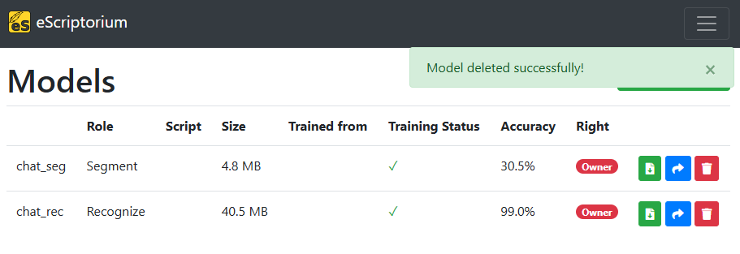

在地方志数字化工作流中引入 CHAT 的经验如下：

1. **模型获取与管理**：在 eScriptorium 的 “Model repository” 面板导入 `.mlmodel` 文件，或通过 `python manage.py import_model` 批量注册；建议对 chat_seg/chat_rec 各保留一份原始副本，再复制出项目专用版本，以便微调与回滚。
2. **分割流程**：先用 chat_seg 生成区域/行，随后在 “Masks & Baselines” 视图检查双列、边注的分割结果。对于错判区域，可手动绘制遮罩或补画基线，让读取顺序模块有足够几何信息。
3. **识别与校对**：chat_rec 对横排/竖排皆可工作，但竖排模式下需在文档描述中正确设置 `read_direction=TBRL（Top-to-Bottom, Right-to-Left，从上到下，从右到左的古典汉语排版格式）`。初稿生成后，借助协作校对面板批量修订；与 XDXF（XML Dictionary eXchange Format 字典交换格式）、TEI（Text Encoding Initiative 文本编码倡议） 等导出格式结合，可以快速建立地方志全文索引。
4. **进一步训练**：若要提升特定卷帙的准确率，可选取 20–30 页手工校对的行作为微调数据，使用 `ketos segtrain` / `ketos train --resize union` 在 GPU 上增量训练。工作流程与“模型训练”章节一致，只是起点改为 chat_seg/chat_rec。

需要注意的局限包括：chat_seg 仍偏向单列卷轴，对多栏排版常出现区域断裂；chat_rec 对罕见异体字、撰改符需额外扩展字符集；而读取顺序必须依赖新版几何算法或自训 RO（Reading Order） 模型才能稳定。总体而言，CHAT 套件提供了可靠的起跑线，但要在地方志这种版式复杂、异体字频繁的材料上达到出版级质量，仍需结合项目特定的遮罩修正与微调策略。

## 关于 Kraken 引擎

eScriptorium 的核心是 Kraken，一款强大的开源光学字符识别（OCR）引擎，专为识别和转录手写及印刷文本而设计，特别适用于复杂布局和多语言内容的处理。Kraken 的前身是 Ocropus，一个早期的 OCR 系统，主要面向印刷文档的识别。相较于 Ocropus，Kraken 在 手写识别和多语言支持方面实现了重大改进，使其成为 eScriptorium 平台不可或缺的核心组件。

为了确保最佳识别效果，Kraken建议处理列宽超过 90 像素的二值化图像，以提供足够的视觉信息进行准确解析。此外，阅读顺序模型目前正在开发中，并计划随 Kraken 主分支的更新一同发布，以进一步提升对复杂文档结构的解析能力。(Kiessling, 2019)

## 在地方志数字化项目中的应用

中华地方志深度开发，最基础的工作是数字化，将扫描的古籍图像进行OCR文本识别。古代地方志文本识别的一个难点是竖排双列排版方式或手写体，在评估了众多的OCR工具以后认为，eScriptorium 作为核心识别和转录工具其适合用于将地方志文献转化为便于检索、引用和研究的数字化格式。目前已有 9000 多种扫描版 PDF 和 DJVU 电子书，这个数字还在增加，使用 eScriptorium 对这些图像文件进行光学字符识别（OCR）和文本校对，并构建图像与文本结合的全文检索系统是可行的。eScriptorium 平台的多层次页面分割与深度学习技术能有效应对地方志手稿中常见的复杂文本结构和多样的书写风格。

eScriptorium 在自动转录过程中表现出显著的可行性，特别是在去除背景噪声、识别红墨标注、处理不同布局（如双行排版）等方面具有较大潜力，符合地方志文献数字化的要求。

## eScriptorium 安装

最方便的安装办法是使用docker，本地完全安装适合进一步开发。系统要求苹果或Linux操作系统。Windows下Docker安装可能在调用GPU训练时，设置上有点问题。如果使用GPU,需要修改相关的设置，经过多次测试，至今没有找到docker-compose.yml和docker-compose.override.yml之间的冲突，所以可以把以下代码直接修改在docker-compose.yml上：
  celery-gpu: &celery-gpu

<<: *app

shm_size: '3gb'

runtime: nvidia

environment:

- KRAKEN_TRAINING_DEVICE=cuda:0

- NVIDIA_VISIBLE_DEVICES=all

- NVIDIA_DRIVER_CAPABILITIES=all

command: "celery -A escriptorium worker -l INFO -E -Ofair --prefetch-multiplier 1 -Q gpu -c 1 --max-tasks-per-child=1"

## eScriptorium使用

## 导入图片

导入图片或者直接导入PDF，导入PDF会自动分割成图片页面（如图1）。

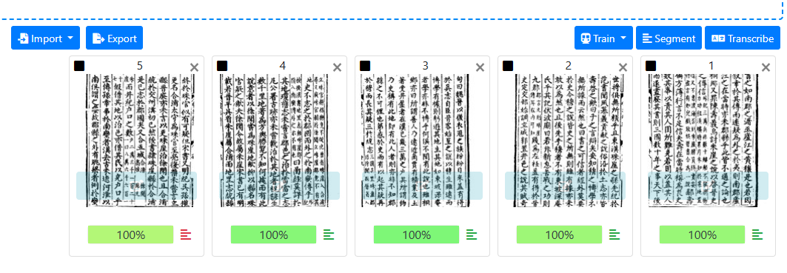

Figure  导入图片

## 页面分割

这里面有两个概念需要区别清楚，阅读方向（Read Direction） 指的是文档中元素（如文本行或段落）的排列顺序，而文本方向（Text Direction） 则指行内单词或字符的排列方向，由书写系统决定。例如，在竖排双栏古籍中，阅读方向通常是先读右栏再读左栏，而文本方向可能是从上到下（如传统汉文书写）。阿拉伯语、波斯语、希伯来语的阅读方向和文本方向均为右到左（RTL），而传统竖排中文、日文的阅读方向是右到左，但文本方向是上到下、右到左（TBRL（Top-to-Bottom, Right-to-Left，先列后行）），即从右侧列开始，自上而下书写，再向左移动至下一列。现代横排的中文、日文、韩文及大多数拉丁语系文字则阅读方向和文本方向均为左到右（LTR）。

阅读方向由文字系统决定，所以新建文档的时候，在文档描述（Description）中设定，对于汉语古籍的识别，文字系统应该选择汉语传统变体（Han Traditional Variant)，阅读顺序选择从左到右，或者从右到左。这两种顺序，虽然并不会影响页面分割和识别精确度，但在一定程度上会影响识别结果文本的阅读顺序，比如选择从左到右，纯粹单行版面会比较准确地从左到右进行排序。假如你改成从右到左，重排行顺序（点击分割区域segmentation panel顶部的自动重排行Reorder line automatically按钮），行排序会自动从右到左重排。

但是文本方向需要在文本分割与排序时正确设置，分割时选择模型、分割步骤和文本方向（Text_Direction），以确保 OCR 识别后的文本结构符合原书的逻辑顺序，避免段落错序或行内字符排列错误。

页面分割（Segmentation）有几种选项，古代县志版面往往整页都是连续的文字，所以选择第2种，如果是版面复杂的杂志报纸选择第1种。从零开始训练，需要手工分割图片，使用第3和第4，增加遮罩或文本区域。对初步训练的模型进行优化，则选择第2种，主要增加文本行、基线和遮罩的精确度，下面详细介绍这4种选项的意思：

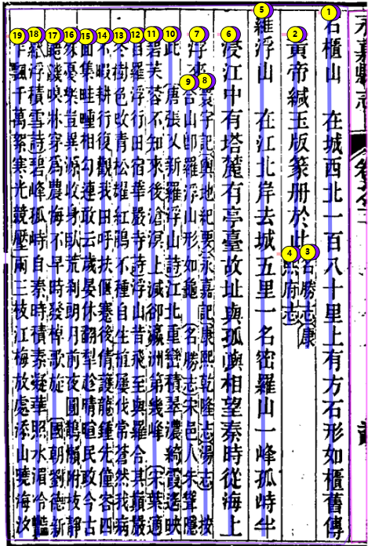

Figure 页面分割

1. Lines and Regions（行与区域）

该模式同时检测文本区域（Regions）和文本行（Lines），适用于多栏文本、含注释、标题、脚注等复杂版面的文档，如古籍、报刊等。它能保留完整的文本结构，适合版面复杂的 OCR 任务。

2. Lines, Baselines and Masks（文本行、基线和遮罩）

该模式检测文本行（Lines）、基线（Baselines）和文本遮罩（Masks），但不会创建文本区域。适用于手写文稿、弯曲文本或非标准排版，适合基于基线（Baseline-based）OCR 训练。

3. Only Line Masks（仅文本行遮罩）

该模式仅检测文本行的遮罩（Masks），不提供基线或完整文本行区域。适用于自定义 OCR 训练或图像分割，可手动调整文本区域，适合特殊字体或实验性 OCR 任务。

4. Regions（仅文本区域）

该模式仅检测文本区域（Regions），不检测具体的文本行。适用于需要手动标注文本内容、版面结构复杂但不要求行级分割的情况，适合版面分析或分类任务。

## 手工校对

新版的几何分组算法解决了大多数竖排双栏页面的阅读顺序问题，常规页面仅需人工确认即可。如果偶尔出现行序错乱，可以在 “Text” 面板点击 “Toggle sorting mode” 进入手动排序：选中误排的行，通过拖拽或上下箭头调整顺序，有时需要刷新页面。在涉及表格或嵌套双行的页面，仍建议改到 “Regions” 视图先调整区块顺序，再在行级排序里细调——表格通常需要逐行或按单元格顺序插入，避免识别结果把列内容串联在一起。

如果项目对阅读顺序的自动化依赖度很高，也可以考虑额外训练阅读顺序模型（Reading Order, RO）：导出带正确顺序的 PAGE XML，用 `ketos rotrain` 生成 RO 模型，再通过 `ketos roadd` 与分割模型合并后上传。不过在新版算法下，这一步主要针对极复杂版式或批量表格页面才值得投入。

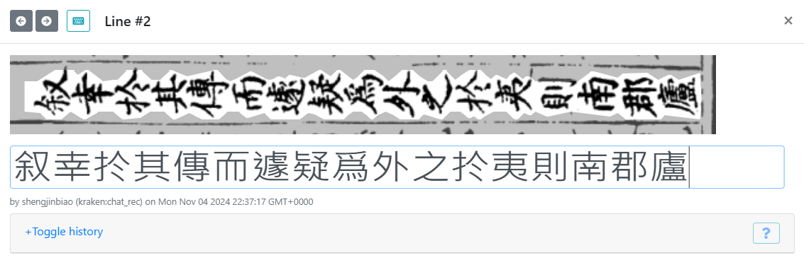

Figure 手工校对

图4可以看到，识别后的阅读顺序从左到右，分割的列逆时针旋转90°，汉字的方向“躺平”了。只有选择日本竖排汉字时候，识别文本和分割的列都是竖排，然而校对时需要一短时间熟悉输入法和文本方向的衔接。因为输入法拼音也会竖着排列，全拼输入的话，拼音字母之间有很大的空格，鼠标的光标会往下走很远（如下图）。

| 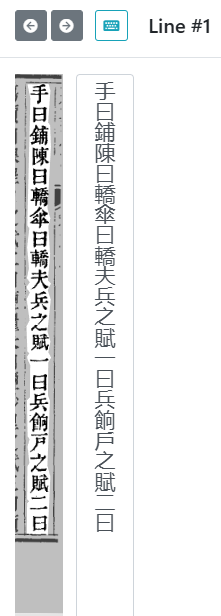 | 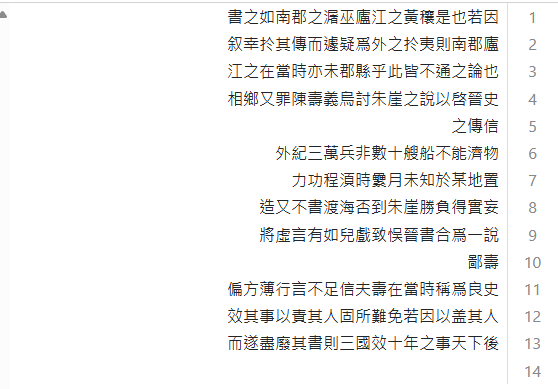 |
| --- | --- |

Figure  识别结果


## 识别结果文本

导出识别结果文本的格式，按照现代汉语横排从左到右的阅读顺序，因此图像分割和手工校对阶段应该不管选择哪一种模式，都不会影响导出结果，比如选择竖排文本格式，虽然在手工校对阶段显示的是竖排文字，但是导出结果时仍然是横排（见图）。

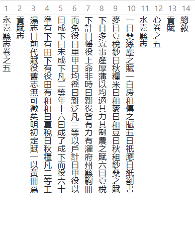

Figure  日文和古汉语竖排文本

- 结果导出

--------------- Element 1 (page_168.png) ---------------

永嘉縣志卷之五

貢賦志

湯志曰前代賦役舊志無可徵矣明初定賦一以黃冊爲

準有下有田下有役田有租租曰夏稅曰秋糧凡二等工

曰成下曰未成下凡二等年十六曰成了成下而役六十

而免役曰里甲曰均徭曰雜泛凡三等以戶計曰甲役以

下計曰徭役上命非時曰雜役皆有力有濯府州縣駒冊

下日多寡事產厚薄以均適其力其制農之賦六曰夏稅

麥曰夏稅鈔曰秋糧米曰租麥曰租豆曰秋租鈔桑之賦

一曰桑絲塵之賦一白房租傳之賦五曰祇應曰紙劄書

水嘉縣志

心卷之五

貢賦

總敘

## 模型训练

中华地方志深度开发，最基础的工作是数字化，将扫描的古籍图像进行OCR文本识别。古代地方志文本识别的一个难点是竖排双列排版方式或手写体，采用 eScriptorium进行图片预处理、图片分割、文本识别和模型训练，Kiessling等人使用eScriptorium对英文和拉丁化的阿拉伯语混合的图书目录识别，使用大约350行手工标记的数据集进行模型训练，可以达到99%的识别准确率(Kiessling等, 2019)。

对于汉语古籍，笔者测试的《光绪永嘉县志》，竖排每页只有单行10行，双行排列最多20行，那么如果从零开始训练，得手工处理三十页左右，就可以训练出一个比较靠谱的分割和识别模型。

需要注意的是，在已有模型基础上训练，必须有非常精确的标注真值（Ground Truth），包括页面分割和手工校对的文本，要不然反而会损害模型的准确率。

版面分割模型训练的输出日志如下：

```
celery-gpu-1           | [2025-02-11 04:32:13,158: INFO/ForkPoolWorker-3] validation run:
accuracy 0.9893519282341003
mean_acc 0.9893519282341003
mean_iu 0.35225552320480347
freq_iu 0.890562117099762
```

第一行表示训练的设备是GPU-1，笔者使用的是一款非常老旧的NVIDIA GTX 1050 ti。

第二行validation run是指运行校验，训练开始OCR引擎对图片进行检测，并作出大概的分割，然后每次 validation run 都會根据用户手动分割（所谓的ground truth）跟预测分割进行校验，输出几个关键指标。

第三行accuracy：0.989xxx（99%左右），表示整體像素級準確率。一种OCR页面分割的算法是根据图片像素，空白区域和文本的像素不同，比如8比特的黑白图片，白色用255表示，黑色用0表示，那么预测的时候，根据一个阈值T猜测整个页面哪些是空白，哪些文本。

mean_acc：與 accuracy 相同，應該是所有類別的平均準確率。

mean_iu：這是 Mean Intersection over Union（平均交並比），主要衡量 模型的語義分割效果，即預測與標註的重疊程度。

freq_iu：頻率加權 IoU，權重較高的類別影響更大。

图 4 是Ubuntu的机器性能监控Btop，显示GPU使用率100%，温度63°C，训练非常耗能，所以散发很多的热量。我们可以看到，这是一款非常老旧的GPU，只有4GB的显存。

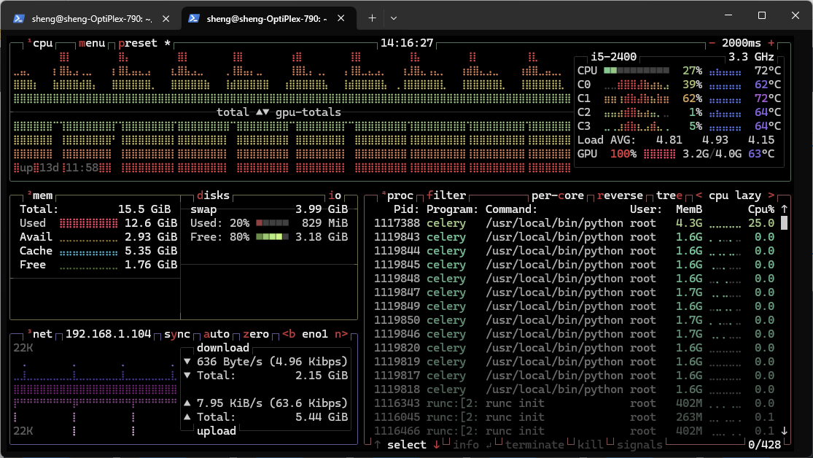

Figure  监控GPU使用率100%，温度63°C

## 使用 kraken 训练模型

可以将eScriptorium的标注和识别结果导出，使用 kraken 分开来训练。导出文件中包含一个 METS.xml 需要删除。

在安装 kraken 以前，需要根据显卡驱动的版本，安装cuda toolkit工具包，分别用 nvidia-smi 和 nvcc 这两个命令检查是否已经安装成功。典型步骤如下：

```
sheng@SummerHeath:~$ python3 -m venv kraken_env    # 建立虚拟环境
sheng@SummerHeath:~$ source kraken_env/bin/activate
(kraken_env) sheng@SummerHeath:~$ pip install 'kraken[pdf]'
```

训练页面切割模型：

```
(kraken_env) sheng@SummerHeath:~$ ketos segtrain -d cuda:0 -f xml /mnt/c/Users/sheng/Downloads/export_doc8__pagexml_202503062244/*.xml
```

开始训练时，会出现如下提示：

```
Training line types:        # 训练文本类型
default       2     328     # 缺省单行标记数量
DoubleLine    5     952     # 双行标记数量
Correction    8     1       # 校正行数量

Training region types:      # 训练文本区域类型
Main          3     44      # 主要文本区域
Margin        4     41      # 页眉
text          6     25      # 其他文本类型
Illustration  7     7       # 插图类型
```

训练日志还会输出硬件配置，例如：

```
GPU available: True (cuda), used: True
TPU available: False, using: 0 TPU cores
HPU available: False, using: 0 HPUs
```

## 在已有模型上微调识别

在使用现有模型基础上（Fine tuning）训练新的字体或添加新字符时，可能会出现新旧字符集不匹配的问题。这时可使用 ketos train 命令的参数 --resize 进行调整，常用模式有：

合并模式（union）：

- 将原模型已有字符与新训练数据的字符合并，不会删除原有字符，只增加新的字符。

- 例如：

    - 原字符集：{天, 地, 玄, 黄}

    - 新训练数据字符集：{玄, 宇, 宙}

    - 使用union模式后合并为：{天, 地, 玄, 黄, 宇, 宙}

新模式（new）：

- 使用新数据的字符集直接替换旧字符集，删除原字符集中不再出现的字符。

- 例如：

    - 原字符集：{天, 地, 玄, 黄}

    - 新训练数据字符集：{玄, 宇, 宙}

    - 使用new模式后字符集为：{玄, 宇, 宙}，删除了旧字符集中的天, 地, 黄。

因此，合并模式适用于在现有字符集基础上增加少量新字符或新字体，新模式适用于完全替换字符集，适合训练目标字符明确变化的场景。

下面这个命令使用 Kraken (`ketos train`) 在 GPU 0 (`cuda:0`) 上进行 OCR 识别模型的微调训练，基于已有的预训练模型 `yongjia_rec.mlmodel`，并通过 `--resize union` 适配新的 PAGE XML 格式数据（`*.xml`），`-v` 标签输出训练过程提示：

```
(kraken_env) sheng@SummerHeath:~/romodel$ ketos -v train -d cuda:0 --resize union -f page \
    -i /mnt/c/Users/sheng/Downloads/yongjia_rec.mlmodel \
    /mnt/c/Users/sheng/Downloads/export_doc8__pagexml_202503110104/*.xml
```

常见的日志片段如下：

```
INFO     Resizing codec to include 15 new code points                  train.py:574
[03/11/25 21:09:04] INFO     Resizing last layer in network to 16396 outputs               train.py:582
INFO     Adding 0 dummy labels to validation set codec.                train.py:615
[03/11/25 21:09:18] WARNING  Neural network has been trained on mode L images,
set contains mode 1 data. Consider setting `force_binarization`
```


训练日志显示模型的字符集增加了 15 个新字符，使输出层扩充到 16,396 个字符，这适合中文 OCR 场景。此外，日志提示当前训练集采用二值图像（mode 1），而此前模型基于灰度图像（mode L）训练，建议统一图像模式或开启 `--force-binarization` 以提升识别精度。示例命令如下：

```
(kraken_env) sheng@SummerHeath:~/romodel$ ketos -v train \
    -d cuda:0 \
    --resize union \
    -f page \
    -i /mnt/c/Users/sheng/Downloads/yongjia_rec.mlmodel \
    --force-binarization \
    /mnt/c/Users/sheng/Downloads/export_doc8__pagexml_202503110104/*.xml
```

关键参数说明：
- `-v`：输出详细日志；  
- `-d cuda:0`：指定使用第 0 块 GPU；  
- `--resize union`：用并集方式扩展字符集；  
- `-f page`：输入数据为 PAGE XML；  
- `-i`：加载已有识别模型继续训练；  
- `--force-binarization`：训练前强制将图像转换为二值图。

通常情况下，Kraken 的默认超参数（hyperparameters）对大多数应用场景效果都很好。但是通过尝试更低的学习率（learning rate）能获得更好的效果。(The Digital Orientalist, 2023) 学习率可以用命令中的-r或--lrate选项来指定。Kraken 官方文档推荐的学习率是1e-3（即0.001），但是对于汉语古籍识别，采用更低的学习率1e-4（即0.0001）效果更佳，笔者一次测试显示，使用相同的标记数据给在模型微调，降低学习率（-r 0.0001），微调后模型的准确率可以提高10%。

## 古籍单双行混排模型训练

Kraken OCR 采用无分割的序列到序列（segmentationless sequence-to-sequence）识别方式，利用混合卷积-递归神经网络（CNN+RNN）进行字符识别，无需逐个字符分割，而是直接识别整行文本，从而避免了传统 OCR 在字符切分上的困难，提高识别准确度。(Kiessling等, 2021) 识别器本身只接受已经裁剪好的行图像；页面二值化、行检测和遮罩生成仍依赖前序的分割模型或人工标注。

在训练和测试《光绪永嘉县志》模型时，我发现一些特定结构（如“（康熙志）”）被识别成“康熙志志”。排查后认为是标注时误多录一个“志”，模型在整行训练中将其视为固定模式。为了把这类位置敏感的信息捕捉进去，我尝试把单双行混排段落合并成单条长行标注，希望网络通过更宽的 receptive field 记住上下文。

实验结果并不理想：1）Kraken 采用 CTC（Connectionist Temporal Classification）解码，要求模型输出的时间步长（即横向扫描的切片）与真实字符顺序严格对应。混排行在标注中强行拼接左右列，推理时如果读序稍有偏差，就会在 CTC 的合并阶段出现字符重复或丢失；2）为了让网络一次处理不同宽度的行，训练脚本会把行图像统一缩放并在两侧补空白（padding），混排行的宽高比远超常规基线，被缩放后笔画变形、补白比例过大，卷积层提取不到稳定特征；3）识别输出仍是一长行文本，校对时还得手动按原列拆分，反而增加负担。综合这些因素，我放弃了混排行训练，改回逐列逐基线标注，并结合阅读顺序重排来保证上下文正确。

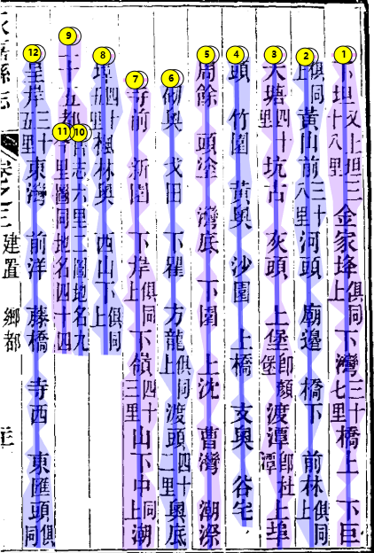

Figure  单双行混排页面

## 复杂版面分割、识别和训练

项目实践中最棘手的版式来自“嵌套双行”“夹注夹批”或单双行在同一阅读序列中交替出现的页面：外层是常规竖排正文，内层则嵌入一列或两列窄行的补注、人物官职表或表格。肉眼阅读依赖列间留白、分割线甚至批注符号来辨认层级，但在扫描图像中，这些辅助信号容易被噪点和压缩伪影削弱，导致自动分割结果把两层文本混为一谈。

在 eScriptorium 中处理此类页面时，可以遵循“三步法”。第一步是用区域（Region）划定功能块：正文、批注条、表格等分别成区，减少跨区域排序干扰。第二步在每个区域中逐条绘制基线，遇到嵌套双行时保持“先外后内”的顺序，必要时把窄行拆成多条独立基线，避免基线折返。第三步利用阅读顺序面板（Reading Order）逐区调序：先固定正文列，再按出现顺序插入补注行，确保 PAGE XML 中的行序与实际阅读一致。

训练数据也需要配合复杂版式做管理。建议在导出时为不同区域或基线加上标签（如 `region_type=margin`、`line_role=side_column`），并保持各类型样本数量均衡，让识别模型见到足够的窄行或断句符号等等。若混合训练后的准确率仍不稳定，可尝试分开训练“正文模型”和“补注模型”，识别阶段按区域调用；或继续使用统一模型，但在评估时关注这些标签的错误率，以决定是否需要额外的增量标注（figure 8 嵌套双行 “日半”“年失”）。

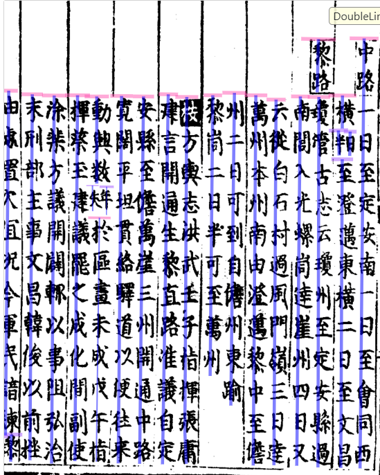

## Party 模型（逐页文本识别模型）

party（PAge-wise Recognition of Text-y）是传统 ATR 系统中文本识别器的替代方案(Mittagessen, 2025)。它不再依赖传统的“基线 + 边界多边形”方法，而是去除了对边界框数据模型的需求。

party 由一个 Swin 视觉 Transformer 编码器、基线位置嵌入（baseline positional embeddings）以及基于八位元（octet）分词训练的小型 Llama 解码器组成。

在最新版本中，party 引入了“语言标签（language tokens）”，允许用户在推理阶段对每一行文本的输出指定语言方向。虽然这些标签是可选的，但在处理难度较大的材料时推荐使用，以避免系统在多语言之间随机切换。当没有提供语言标签时，模型会自动生成一个或多个标记，指示它认为当前行文本中包含的语言。

目前带有语言标签支持的新基础模型仍处于保密期，但已经有一个针对多种欧洲语言微调过的模型可供使用。

该模型在训练语料覆盖的语言和文字体系上表现相当优秀，但在实际应用中，通常仍需要进一步微调，以确保符合特定的转录规范。

传统的 ATR（Automatic Text Recognition自动文本识别） 系统一般有以下几个特点：

- 依赖页面分割（segmentation）

    - 先把整页图像划分为区域（region）、行（line）、列（column），再划定每行文字的 基线（baseline） 和 边界框（bounding box）。

    - 每个字符或单词需要被“框”出来，然后送入识别模型。

- 基线 + 边界框模型

    - 基线（baseline）：表示每行文字的基准线，用来确定文字的书写方向与位置。

    - 边界框（bounding polygon/box）：用多边形或矩形框住整行或单个字符，提供位置约束。

    - OCR/HTR 引擎（如 Kraken、Tesseract）通常基于这些标注进行训练和识别。

- 局限性

    - 对复杂布局（如竖排、双栏、混合注释）适应性差。

    - 标注边界框和基线需要大量人工工作。

    - 在边缘化的古籍、手稿场景中，容易出现切分错误，导致识别率下降。

而 party 的新方法就是：

- 不再依赖“边界框”作为输入，直接用 Transformer 编码整行图像 + 基线位置嵌入来识别。

- 这样可以简化标注流程，提升对复杂手稿和跨语言材料的鲁棒性。

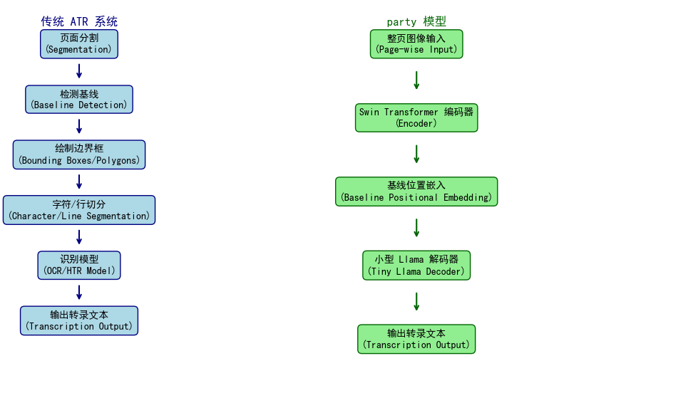

Figure  传统OCR模型与人工智能识别模型的区别

## 7. 语义检索与地方志知识问答

### 7.1 关键词检索的背景与中文挑战

eScriptorium 的全文检索依托 Elasticsearch。传统的 BM25 倒排索引面对中文这类“无空格”语言时，需要高质量分词才能保持召回率与准确度。我们在 Docker 镜像中启用了官方 `analysis-smartcn` 插件，并在索引管理命令中自定义 mapping，使中文词语得到正确切分，从而支撑多音节词和模糊匹配。然而，单纯的关键词搜索仍难召回语义等价的句子，也无法直接回答自然语言问题。

### 7.2 向量化语义检索与 LLM 的结合

为弥补上述不足，我们新增 OpenAI Embedding + Elasticsearch `dense_vector` 的语义检索管线：

1. **段落抽取**：`generate_passages` 将行级转录拆分为段落 `DocumentPassage`，记录原文、规范化文本与元数据。
2. **向量生成**：`generate_embeddings_for_passages` 调用 OpenAI Embedding API，将向量缓存到段落实体中。
3. **索引同步**：`index_semantic` 将段落、向量、元数据写入 Elasticsearch 8，启用 HNSW (Hierarchical Navigable Small World) 检索。
4. **在线检索**：`semantic_search` 在用户查询时生成问题向量，通过 ES `knn` 端点获取相似段落与得分。

在此基础上，我们使用 `build_semantic_answer` 整合语义命中的段落，拼接成带编号的上下文，调用 OpenAI Chat Completion（配置于 `providers.yml`）生成带 `[1][2]` 引用的自然语言回答，并把引用信息返回给前端。

#### 切换至本地嵌入模型（以 LM Studio 为例）

在内网或离线环境中，我们也可以把嵌入和聊天模型部署在 LM Studio 等 OpenAI 兼容推理服务上。由于本地模型的向量维度常与 OpenAI 不同（例如 `text-embedding-nomic-embed-text-v1.5` 输出 768 维），需要按下列步骤调整配置并重建语义索引：

1. **更新模型配置**
   - 在 `config/providers.yml` 中把 `openai.base_url`、`embedding.base_url` 指向 LM Studio（如 `http://192.168.1.103:1234/v1`），并写入本地模型 ID。
   - 如果模型维度不等于 1536，需在 `variables.env` 中显式设置：
     ```
     SEMANTIC_EMBEDDING_MODEL=text-embedding-nomic-embed-text-v1.5
     SEMANTIC_EMBEDDING_DIM=768
     ```
     保存后执行 `docker compose up -d web celery-main`（或重启相关容器）让 Django 读取新的环境变量。

2. **清理旧向量索引**
   - 进入 Elasticsearch 容器查询现有索引：`docker compose exec elasticsearch curl http://localhost:9200/_cat/indices?v`。
   - 删除旧的语义索引（默认 `es-passages`、`es-transcriptions`）：`docker compose exec elasticsearch curl -X DELETE http://localhost:9200/es-passages`。

3. **重新生成数据**
   - 重新抽取段落：`docker compose exec web python manage.py generate_passages --reset`。
   - 计算嵌入，可直接在 Django shell 批量执行：
     ```bash
     docker compose exec web python manage.py shell -c "
from core.services.embedding import pending_passage_ids, generate_embeddings_for_passages
ids = pending_passage_ids()
print('pending', len(ids))
print(generate_embeddings_for_passages(ids, force=True))
"
     ```
   - 写入 Elasticsearch：`docker compose exec web python manage.py index_semantic --drop`，此时索引会按 `SEMANTIC_EMBEDDING_DIM` 创建新的 `dense_vector` mapping。

4. **验证**
   - 再次查看 `_cat/indices`，确认文档数量大于 0。
   - 在 `/search` 页面执行一次语义检索，若不再出现 400 错误，即表示本地模型切换成功。

通过上述步骤，即可在不依赖 OpenAI 公网的情况下运行完整的语义检索 + LLM 答复流程。

### 7.3 地方志知识问答与前端展示

- **接口**：`POST /api/search/semantic/` 同时返回 `hits`（段落列表）、`answer`（问答文本）与 `citations`（引用元数据），支持 `limit`、`documents`、`document_parts` 等过滤参数。
- **页面**：在 `/search/` 页面顶端新增“AI Answer”卡片与“Semantic Matches”列表，关键词结果仍保留，方便比对；用户可在同一搜索框既使用传统关键词，也获取语义问答结果。

### 7.4 命名实体与精度提升展望

语义检索打通后，后续可将命名实体识别（NER）结果写入同一索引，按人名、地名、机构等维度进行检索或问答；还可对引用得分做重排序、融合关键词结果，进一步提升回答准确度与可解释性。

### 7.5 自动化管线的整体前景

至此，平台实现了“图像分割 → 文本识别 → 人工校对 → 标点翻译 → 段落结构化 → 语义检索/知识问答”的闭环。若再结合命名实体与知识库构建，就能在地方志等历史手稿场景下提供从数据化到知识服务的一站式解决方案，显著降低跨工具操作成本，拓展未来的专题研究和公众展示能力。

### 中华地方志知识库的首轮成果

近期围绕《永嘉县志》等样本，对 eScriptorium 进行了知识库扩展，初步交付结果如下：

#### 基础知识模型的构建

1. **数据模型**

- 新增 `gazetteer` 子应用，实现以下主要模型：
  - `Dynasty`：朝代信息，包含名称、起止年份、描述等
  - `Location`：地点信息，支持历史名称与现代名称映射，行政区划编码，多级地点层级关系
  - `Category`：方志内容分类，如地理、历史沿革、文化、经济、教育等
  - `Gazetteer`：方志基本信息，包括标题、朝代、年份、编纂者、地点等
  - `Entry`：具体条目内容，关联方志和分类，包含内容文本和页码
  - `Entity`：知识实体，如人物、地点等，包含名称、类型、描述
  - `EntityRelation`：实体间关系，记录关系类型与描述

2. **数据管理**

- 开发了测试数据生成脚本 `create_test_data.py`
- 包含示例数据：
  - 明清两代基础信息
  - 江苏（江南）、浙江等地域层级关系
  - 《姑苏志》《杭州府志》等方志示例
  - 多类型条目内容样本
  - 编纂者、地点等实体及其关系网络

#### 用户界面与导航

1. **全局导航栏**
- 在主导航中添加知识库入口，位于 Models 链接之后
- 使用全新设计的 BookIcon 作为知识库图标
- 支持选中状态高亮显示，提升用户体验

2. **路由配置**
- 实现主要路由：
  - `/`: 方志列表页面
  - `/gazetteer/:id`: 方志详情页面
  - `/entities`: 实体列表页面
  - `/entity/:id`: 实体详情页面
  - `/knowledge-graph`: 知识关系图谱页面

3. **组件开发**
- `GazetteerList.vue`: 方志列表展示
- `GazetteerDetail.vue`: 方志详细信息
- `EntityList.vue`: 实体列表与筛选
- `EntityDetail.vue`: 实体详细信息与关系
- `KnowledgeGraph.vue`: 基于 vis.js 的关系图谱可视化

#### 特色功能实现

1. **实体标注系统**
- 支持在文本中标注人物、地点、机构等实体
- 实现实体关系的建立与展示
- 提供实体检索与关系分析功能

2. **地理信息整合**
- 历史地名与现代地名对照
- 多级行政区划体系
- 地理位置可视化展示

3. **知识图谱展示**
- 实体间关系的可视化
- 交互式关系网络探索
- 支持关系路径分析

4. **测试数据支持**
- 提供完整的示例数据集
- 支持一键初始化测试环境
- 便于功能演示与测试

这些功能整合形成一个完整的知识库系统，为中华地方志的数字化研究提供了坚实基础。系统支持从文本识别到知识提取的完整工作流，并通过直观的界面展示让用户能够便捷地访问和探索方志中的知识内容。
- **导入流水线**：实现 `python manage.py import_catalog_data` 管理命令，支持将“温州古旧方志目录”“乾隆温州府志卷首结构”“明清地名志数据表”等 Excel/CSV 批量导入，并自动对齐字段、处理重复。
- **API 暴露**：在 `/api/knowledge/catalog|structure|places/` 提供 REST 只读接口，带关键字搜索与枚举过滤，便于语义检索、图谱或第三方脚本直接复用地方志元数据。
- **前端入口**：新增 `/knowledge/` 页面及三份目录视图，侧边栏仿 Django Admin 的 list-group 过滤器，可按馆藏地、分类、标题级别、语种、朝代、行政层级等条件快速筛选。
- **部署指南**：Docker 环境下仅需执行 `docker compose exec web python manage.py migrate knowledge` 与导入命令，即可重建数据库结构并导入最新资料。

借助上述改动，志书目录、卷首结构与地名参考三类基础数据已经纳入统一的知识框架，为下一阶段的一体化抽取（人物、事件、制度）与知识图谱构建打下了基础。

## 8. 实体标注工作流规划

为了把 HanLP 自动抽取与人工校对整合成 doccano / Label Studio 式体验，并服务后续的地方志知识库建设，实体标注子系统将分阶段演进。

### 8.1 阶段目标概览

- 形成“自动识别 → 人工复核 → 知识化沉淀”的闭环；
- 在 Diplomatic 面板内完成实体的查看、筛选、编辑与批量操作；
- 将审核结果回写至语义检索与知识库，支撑人名、地名等主题研究。

### 8.2 第一阶段成果（2025-10-29）

- **实体检查器**：点击高亮即可在侧栏查看并编辑实体类型、规范化名称、属性与置信度，支持一键删除。
- **实体侧栏列表**：按行号聚合所有 AI 标注，支持搜索、类型过滤、批量接受或删除（自动写入 `status=accepted`）。
- **类型着色**：根据实体类型自动分配颜色，正文与列表同步高亮，快速区分 Person / Location / Organization 等类别。
- **调用修正**：后端 `AIOperations` 识别 `false` 字符串，前端元素级菜单显式关闭标点/翻译，确保“实体抽取”不会额外触发其它 AI 操作。

### 8.3 后续计划

- **审核与导出**：记录用户对实体的处理状态，并支持导出经人工审核的数据，供语义检索或知识图谱使用。
- **模型回流**：将人工修订结果作为训练集，驱动 HanLP/自研 NER 的微调任务，实现“自动标注 → 人工校对 → 新模型上线”的闭环。
- **知识库集成**：把结构化实体写入 Elasticsearch、向量索引或图数据库，增强语义搜索、问答与地方志研究的主题分析能力。

### 8.4 更新记录

- **2025-10-29**：完成实体检查器、实体侧栏、类型着色与前后端调用修正，标志第一阶段交付完毕。

### 8.5 自动实体抽取执行链路

当前实体抽取以 AI 标点层为基准，过程按以下步骤展开：

1. **入口请求**：前端（工具栏或后台命令）调用 `POST /api/documents/<doc>/parts/ai/enrich/`，并在 `operations` 中设置 `entities=true`。`PartAIEnrichmentSerializer` 负责校验页码、转录层与操作选项。
2. **Celery 调度**：序列化数据交给 `core.tasks.run_ai_enrichment`。任务会：
   - 逐页获取 `DocumentPart`；
   - 根据 `operations` 决定是否执行标点、翻译、实体；
   - 若明确指定转录层，则强制使用该层作为输入文本。
3. **准备输入**：`core.services.ai_text.enrich_document_part` 收集当前页的行文本，优先顺序为：显式指定的转录层 → 其他非 AI 转录层。若所有层均为空，直接返回 `empty_source`。
4. **调用 HanLP**：`HanLPEntityExtractor` 加载 `CLOSE_TOK_POS_NER_SRL_DEP_SDP_CON_ELECTRA_SMALL_ZH` 多任务模型，对整页文本执行 `extract`，生成带位置和置信度的 `EntitySpan`，并统一标签（PERSON / LOCATION / ORGANIZATION 等）。
5. **写入数据库**：`knowledge.services.entity_annotation.annotate_part_entities` 将候选实体写入 `TextAnnotation`：
   - `Entity Type`、`Normalized Value`、`Attributes`、`Confidence` 分别映射为 4 个组件值；
   - 同位置已有实体时按置信度和类型优先级决定是否覆盖。
6. **返回结果**：Celery 将插入数量、失败原因封装在响应中，供前端提示用户；若标点层仍为空，则提醒先生成 AI 标点再抽取实体。

> **提示**：实体抽取默认依赖 AI 标点层。若该层为空，建议先运行“生成标点”再触发实体抽取，以提高 HanLP 的识别质量。

## 引用本仓库

若在论文或项目中引用本仓库，可使用以下 BibTeX 条目：

```bibtex
@software{escriptorium_ai_pipeline_2025,
  title        = {eScriptorium {AI}-Enhanced Chinese Manuscript Pipeline},
  author       = {Sheng, Jinbiao and Contributors},
  year         = {2025},
  version      = {ai-Scripta},
  url          = {https://github.com/your-org/escriptorium},
  note         = {Chinese localization, semantic search, and QA enhancements for eScriptorium}
}
```


Kiessling, B. (2019). Kraken—An universal text recognizer for the humanities. DH2019: Digital humanities 2019. https://dh2019.adho.org

Kiessling, B., Kurin, G., Miller, M. T., & Smail, K. (2021). Advances and limitations in open source arabic-script OCR: a case study. Digital Studies / Le champ numérique, 11(1). https://doi.org/10.16995/dscn.8094

Kiessling, B., Tissot, R., Stokes, P., & Stökl Ben Ezra, D. (2019). eScriptorium: An open source platform for historical document analysis. 2019 international conference on document analysis and recognition workshops (ICDARW), 2, 19–19. https://doi.org/10.1109/ICDARW.2019.10032

Mittagessen. (2025). party: PAge-wise recognition of text-y. https://github.com/mittagessen/party/tree/main

Smith, P. (2024, 三月 18). Handwritten Text Recognition of the Dunhuang manuscripts: The challenges of machine learning on ancient Chinese texts [Digital scholarship blog]. Enabling Innovative Research with British Library Digital Collections. https://blogs.bl.uk/digital-scholarship/2024/03/handwritten-text-recognition-of-the-dunhuang-manuscripts.html

The Digital Orientalist. (2023). Train your own OCR/HTR models with kraken, part 1. The Digital Orientalist. https://digitalorientalist.com/2023/09/26/train-your-own-ocr-htr-models-with-kraken-part-1/

Training—Kraken documentation. (不详). 取读于 2025年3月7日, 从 https://kraken.re/main/ketos.html#rotrain
